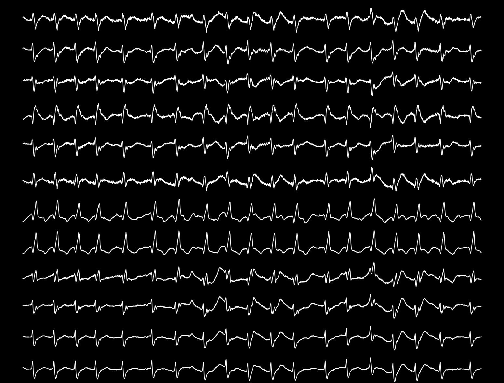

# The WFDB Python Package


## Introduction

The WFDB Python package is a Python-native tool for reading, writing, processing, and plotting physiological signal and annotation data. This package is forked from [MIT-LCP/wfdb-python](https://github.com/MIT-LCP/wfdb-python).

## Enhancements

The plotting functions have been extended to include options for:
- Hiding axes
- Customizing line styles
- Changing background colors

These features allow users to create "clean" ECG plots.

## Example Usage

See the [demo.ipynb](https://github.com/shujuecn/wfdb-python/blob/main/demo.ipynb) notebook for example use cases.

```python
# Read WFDB record
rec_path = "./sample-data/s40000306/40000306"
rd_record = wfdb.rdrecord(rec_path)

# Plot with custom styles
wfdb.plot_wfdb(
    record=rd_record,
    time_units="samples",
    figsize=(20, 15),
    ecg_grids="",      # Remove grid
    title=" ",         # Empty title
    close_axis=True,   # Hide axis
    line_color="w",    # White lines
    bg_color="k",      # Black background
)
```

This will generate a clean ECG plot, as shown below:


